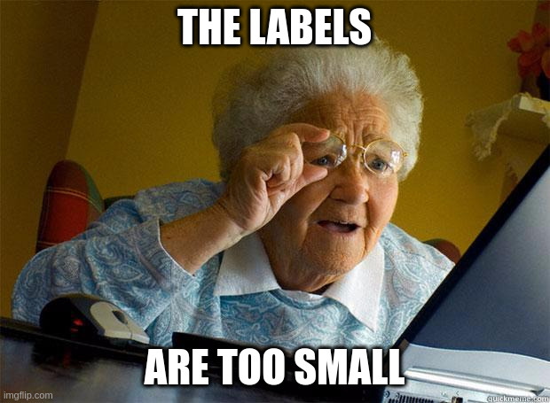

# Sparse video labelling

This repo holds Ubuntu 20.04 assets and a dir structure to help labelling videos for object detection. Such a task can become a gigantic pain in the arse for objects with:

- High speed
- Small size
- Sparse appearances

Find implemented here some pseudolabelling scripts plus a timeseries tool to help you with YOLO labelling frames using YOLOv8 through a docker container.




## Dependencies

- Nvidia-ready Docker (and hardware)
- Labelling tool LabelImg - `pip3 install labelImg`
- Python3
- [Patience](https://pokemonfanon.fandom.com/wiki/Patience_(move)) and a [calm mind](https://bulbapedia.bulbagarden.net/wiki/Calm_Mind_(move))

## Usage

### Hand labelling
 
You always need to do this as a first step.

- Convert your video to frames
    - Maybe you need a venv with cv2 installed `source .venv_cv2/bin/activate.sh`
    - Run the script with `python3 video_to_frames.py * `
    - See arguments with `python3 video_to_frames.py --help`
- Label some initial images by hand
    - We recommend a simple tool like `labelImg`
    - Drop the labels in the `labels/` dir
    - Their names must match the files in `frames/`, extension changed to `.txt`  

You could do the above for all your dataset. However it will probably be much faster to train a poor model to help you find instances, see the next section.


### Pseudolabelling 

This section covers training and running an object detection model on your data for pseudolabelling.

- Train a detection pre-model for pseudolabelling
    - Changedir to the `pseudo` workspace
    - Log in the yolov8 docker container `docker compose run ultralytics`
        - Run `train.sh` to train a premodel:
            - This will automatically copy the labels in `labels/` to a dataset placeholder
            - The images belonging to those labels will be automatically linked there too
            - A model training with a random small test split will start
        - The trained model will be dumped in `pseudo/` and will be used later
        - Exit the docker container
    - Clean up for the next iteration:
        - `rm -f pseudo/dataset/train/*`
        - `rm -f pseudo/dataset/test/*`
            
- Use the pseudomodel to help you label:
    - Changedir to the `pseudo` workspace
    - Log in the yolov8 docker container `docker compose run ultralytics`
        - Link the images you want to infer: `ln -s /frames/*.png /detect/sources`
        - Run `infer.sh` to infer those with the latest model available in `pseudo/models`
        - Detected labels will be dumped into the `detect/all` and `detect/new` dirs
        - Exit the docker container      
    - This stage has no cleanup as we'll use its outputs

- Review the inferred labels by hand:
    - You probably have hand-labelled some of the inferred images already, the strictly new labels are those in `detect/new`
    - Link the images of those labels to that very same dir:
        - Source the libary script `source pseudo/macros.sh`
        - Run `f_link_frames $PWD/frames pseudo/detect/new` 
            - Mind there cannot be trailing `/` for dirs
            - Mind the $PWD variable to get an absolute path to `frames`
    - Verify the new labels by hand using the labelling tool
    - When you're done, copy the corrected labels into the `labels` dir
        - Use `cp -n FILES labels` to avoid overwriting existing files if you like
        - We recommend you make a commit in your local repo to keep that change tracked, or do any other backup strategy of your own
    - Clean up for the next iteration
        - `rm -f pseudo/detect/all/*`
        - `rm -f pseudo/detect/new/*`
        - `unlink pseudo/detect/sources/*`


### Filling bald spots

The above strategy helps greatly in findign appearances spread over our data. We don't usually need to squeeze every last video frame, but some time bald spots in between frames are very relevant, as we could miss some exclusive features such as very small-sized or partially occluded samples. 

Assuming yours is a continuous video of a single moving object at a time, you can plot the positions and sizes of consecutive appearances to guess how objects are moving over time, and identify those edge cases among the labelled images you already have.

- Plot a time series of X, Y and Area of your labels:`python3 scripts/label_time_series.py --dir labels/ --prefix f1c1_`
- Inspect the plot to locate bald spots
- Label sensitive frames by hand


## Thes scripts documented

- `pseudo/macros.sh`: A little bash library with two functions
    - `f_link_frames $fpath $lpath`: symlinks files in `$fpath` whose name matches with those in `$lpath` to `$lpath`, with extension tweaking
    - `f_unlink_frames $path`: removes all symlinks in `$path`

- `pseudo/train.sh`: Automates a fake dataset building and training of a yolov8n network.
    - To be run exclusively within ultralytics docker.
    - Starting checkpoint is fetched from `pseudo/models`
    - Override by setting the env variable `MODEL=my/yolo/model.pt`
    
- `pseudo/infer.sh`: Automates inference of the images in `pseudo/detect/sources`
    - To be run exclusively within ultralytics docker.
    - Inference checkpoint is fetched from `pseudo/models`
    - Override by setting the env variable `MODEL=my/yolo/model.pt`
    - You must link the images into `pseudo/detect/sources` yourself
    - Will store all detections to `pseudo/detect/all`
    - Will automatically compare detections with `labels/` and copy purely new label files into `pseudo/detect/new`

- `scripts/label_time_series.py`: Creates a X-Y-Area timeseries of labels.
    ```
    ## Docstring
    usage: label_time_series.py [-h] [-d DIR] [-p PREFIX] [-s SUFFIX] [-e EXTENSION]
    optional arguments:
    -h, --help                           show this help message and exit
    -d DIR, --dir DIR                    Path to the label-holding dir.
    -p PREFIX, --prefix PREFIX           Prefix in <PREF>XXXX<SUF>.<EXT> . Default ""
    -s SUFFIX, --suffix SUFFIX           Suffix in <PREF>XXXX<SUF>.<EXT> . Default ""
    -e EXTENSION, --extension EXTENSION  Extension in <PREF>XXXX<SUF>.<EXT> . Default 'txt'

    ## Example for video `f1c1.mp4` with labels as in `labels/f1c1_00001-demo.txt`
    python3 label_time_series.py -d "labels/" -p "f1c1_" -s "-demo" -e "txt"
    ```
       
- `scripts/video_to_frames.py`: Extracts the frames from a video file. Frames are numbered in absolute order in an integer-increasing count.
    ```
    ## Docstring
    usage: video_to_frames.py [-h] [-i VIDEO_PATH] [-o IMAGE_PATH] [-p PREFIX] [-d DECIMATOR] [-s IMAGE_SIZE] [-f FIRST_FRAME] [-l LAST_FRAME]
    optional arguments:
    -h, --help                                  show this help message and exit
    -i VIDEO_PATH, --video_path VIDEO_PATH      Path to the input video file
    -o IMAGE_PATH, --image_path IMAGE_PATH      Path to image output dir
    -p PREFIX, --prefix PREFIX                  Prefix for output image files
    -d DECIMATOR, --decimator DECIMATOR         Save only one every _d_ frames
    -s IMAGE_SIZE, --image_size IMAGE_SIZE      Output image square resolution
    -f FIRST_FRAME, --first_frame FIRST_FRAME   First frame to store
    -l LAST_FRAME, --last_frame LAST_FRAME      Last frame to store
    ```
    
<!--

- Video to images
- Label images by hand -> labels


START LOOP 

    - Build a temporary dataset     <- full auto
        - Fetch labelled images
        - Fetch only the images belonging to those labels

    - Train a model on that dataset   <- full auto
        - Have assets prepared to train                    -> output: trained_model
        - Add model to a registry - vX

    - Unleash your model on some/all of your data
        - define infer list                                <- Input
        - Export NEW labels                                -> output: new_labels
        - Delete redundant: some you have already labelled 
        - Label those images by hand
        - (optional) Discard newly created empty labels

    - Add the handlabelled data to the so_far labels 

    - Inspect the time-series to look for gaps
        - Hand label obvious gaps                          -> output: diagram {before net, after net, after manual}
        - Keep a history of these inspections              

    - Add the handlabelled data to the so_far labels 

END LOOP

- Save txt labels in a safe place
- Remove images to save disk


-->

